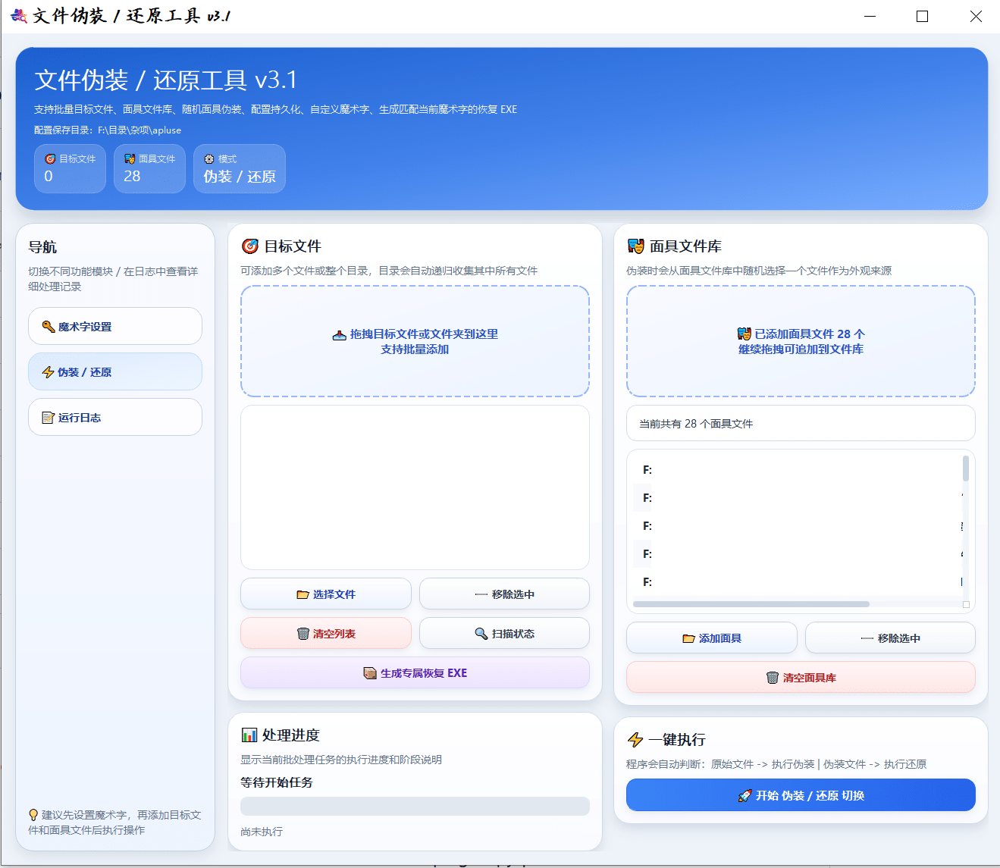
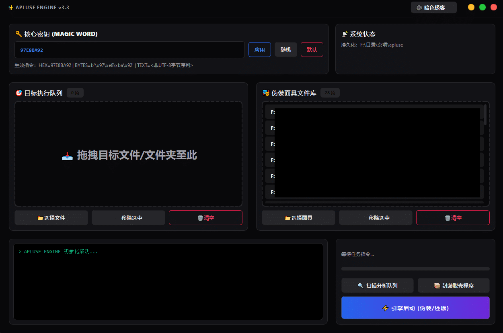
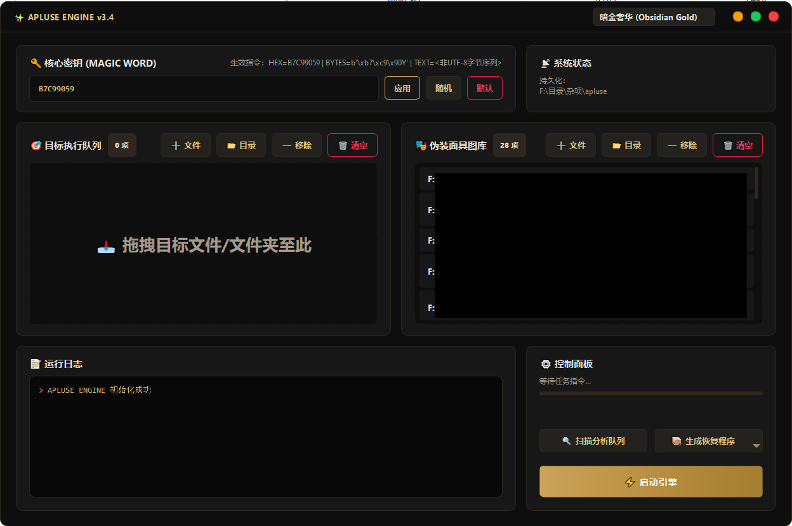
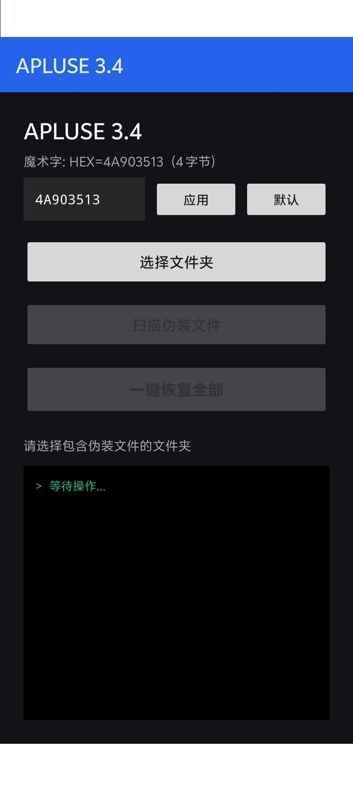

# APLUSE ENGINE v3.4

推广页请见[index](./html/index.html)

基于 [apate](https://github.com/rippod/apate) 思路，用 Python 重新实现的文件伪装/还原工具。通过替换文件头部字节并追加加密元数据，将任意文件伪装为另一种格式（如将 `.rar` 伪装为 `.mp4`），同时支持一键还原，现在支持windows系统和安卓系统的还原。

> **Beta 功能**：集成 [MCPK (MeCapsule Package)](https://github.com/tripodxu/MeCapsule) 打包格式，支持将文件打包为 `.mcpk` 归档。详见下方 [MCPK 实验性功能](#mcpk-实验性功能-beta) 章节。

## 功能特性

**核心能力**

- 一键伪装/还原：自动识别文件当前状态，原始文件执行伪装，伪装文件执行还原
- 批量处理：支持同时操作多个文件或整个文件夹
- 多版本兼容：支持 v1 / v2 / v3 / v4 四种元数据格式的解析与还原
- 自定义魔术字：支持 HEX 和文本两种输入，可随机生成，用于标记伪装文件

**恢复工具生成**
- Windows 恢复程序：打包为独立 `.exe`，无需 Python 环境即可在任意电脑上批量还原
- Android 恢复包：生成 Android 项目，编译为 `.apk` 安装到手机端还原伪装文件
- 恢复程序支持手动输入魔术字，同一工具可适配不同密钥

**界面与体验**
- 7 套主题：暗色极客、亮色极简、渐变幽蓝、暗金奢华、猛男猛粉、辐射废土、低调暗紫
- 拖拽添加：支持将文件/文件夹直接拖入列表
- 文件大小显示：列表项和状态栏实时显示文件数量与总大小
- 键盘快捷键：`Ctrl+O` 添加文件、`Delete` 删除选中、`Ctrl+D` 扫描、`Ctrl+Enter` 启动
- 操作日志持久化：所有操作记录同步写入 `apluse.log`

**安全与健壮**
- 配置文件自动迁移：从旧版 `mask_config.json` 无缝升级到新版配置
- 跨分区兼容：文件移动使用 `shutil.move`，支持不同盘符
- 文件占用检测：被其他程序锁定时给出明确提示
- 批量操作确认：执行前弹出二次确认，防止误操作

## 截图

### v3.1



### v3.3




### v3.4



#### 手机恢复：



## 使用方式

### 基本操作

1. 启动程序后，在「核心密钥」区域确认或修改魔术字
2. 将目标文件拖入「目标执行队列」，或点击按钮选择
3. 将伪装用的媒体文件拖入「面具文件库」
4. 点击「引擎启动」即可自动完成伪装或还原

### 生成恢复工具

伪装完成后，点击「生成恢复程序」按钮，选择：
- **Windows (.exe)**：生成 `{魔术字}_restore.exe`，放到伪装文件所在目录双击运行即可批量还原
- **Android (.apk)**：生成 Android 项目，用 Android Studio 编译后安装到手机

### 键盘快捷键

| 快捷键 | 功能 |
|---|---|
| `Ctrl+O` | 添加目标文件 |
| `Ctrl+Shift+O` | 添加面具文件 |
| `Delete` | 删除选中项 |
| `Ctrl+D` | 扫描分析队列 |
| `Ctrl+Enter` | 启动引擎 |

## MCPK 实验性功能 (Beta)

> **Beta 声明**：MCPK 打包功能目前为实验性功能，API 可能在后续版本中调整。

### 什么是 MCPK？

MCPK（MeCapsule Package）是一种自定义二进制容器格式，专为个人知识管理设计。它将文档、图片、音频、视频及其元数据打包为单一的 `.mcpk` 文件，支持智能分组、灵活加密和独立压缩。

完整项目与格式规范见上游仓库：**[tripodxu/MeCapsule](https://github.com/tripodxu/MeCapsule)**

**核心特性：**
- 单一文件归档：内建元数据、标签和条目关系
- 智能分组：相关文件（如视频与字幕）物理相邻存储
- 灵活加密：XOR 流加密（零依赖）+ AES-256-GCM（高强度）
- 独立压缩：每条目自动选择算法（文本用 zlib，已压缩格式跳过）
- 完整校验：CRC32 完整性校验 + 完整时间戳

### 通过主界面使用 MCPK

1. 启动 APLUSE ENGINE 主程序（`python main.py`）
2. 在主界面找到 MCPK 功能区域
3. 将文件/文件夹拖入 MCPK 打包队列
4. 点击「打包」按钮生成 `.mcpk` 文件
5. 点击「打开 MCPK 文件」或拖入 `.mcpk` 文件浏览内容

MCPK 浏览器支持预览图片、GIF、视频、文本文件，并可将 `.mcpk` 文件发送到伪装引擎进行二次保护。

### 通过命令行使用 MCPK

```bash
# 打包文件/目录
python -m mcpk pack ./notes/ -o archive.mcpk

# 带分组打包
python -m mcpk pack ./project/ -o project.mcpk --group

# 加密打包（XOR，零依赖）
python -m mcpk pack ./secret/ -o secret.mcpk --password mypassword

# 加密打包（AES-256-GCM，需 pip install cryptography）
python -m mcpk pack ./secret/ -o secret.mcpk --password mypassword --encryption aes

# 列出条目
python -m mcpk list archive.mcpk

# 提取全部
python -m mcpk extract archive.mcpk -o ./output/

# 验证完整性
python -m mcpk verify archive.mcpk
```

### Python API

```python
from apluse.mcpk import MCPKWriter, MCPKReader

# 打包
with MCPKWriter("archive.mcpk") as w:
    w.add_file("report.pdf")
    w.add_file("photo.jpg")
    w.import_folder("./my_project/")  # 按文件夹打包

# 读取
with MCPKReader("archive.mcpk") as r:
    for entry in r.list_entries():
        print(entry.name)
    data = r.extract("report.pdf")
    r.extract_all("./output/")
```

### 伪装 + MCPK 双重保护

MCPK 文件可以作为伪装引擎的目标文件，实现「内容加密打包 → 格式伪装」的双重保护：

1. 先将敏感文件打包为 `.mcpk`（可选择加密）
2. 在 MCPK 浏览器中点击「发送到伪装引擎」
3. 选择面具文件（如 `.mp4`），启动伪装引擎
4. 最终文件外观为普通视频，实际为加密的知识归档

详细使用指南见 [doc/mcpk-usage.md](./doc/mcpk-usage.md)

## 环境要求

- Python 3.8+
- PyQt5

```bash
pip install pyqt5
```

**可选依赖（MCPK 增强功能）：**

```bash
pip install cryptography   # AES-256-GCM 高强度加密
pip install zstd           # ZSTD 高压缩比
pip install lz4            # LZ4 极速压缩
```

## 构建

### PyInstaller（推荐）

```bash
pip install pyinstaller
pyinstaller --onefile --windowed --icon=icon.ico -n apluse --add-data "icon.ico;." --clean main.py
```

### Nuitka

```bash
nuitka --standalone --onefile --windows-console-mode=disable --enable-plugin=pyqt5 --windows-icon-from-ico=icon.ico --output-filename=apluse --include-data-files=icon.ico=icon.ico --clean-cache=all main.py
```

### 生成恢复工具的额外依赖

生成 Windows 恢复程序需要系统中安装 Python 和 PyInstaller（程序会自动检测并安装）。

生成 Android 恢复包需要 [Android Studio](https://developer.android.com/studio)，程序会自动创建完整项目，用 Android Studio 打开后一键编译即可。如需自动转换图标，需安装 `pip install Pillow`。

## 项目结构

```
.
├── main.py                    # 程序入口
├── admin_main.py              # 管理员模式入口
├── apluse/                    # 核心包
│   ├── __init__.py            # 公共 API 导出
│   ├── core.py                # 核心引擎：伪装/还原逻辑、配置管理、恢复工具生成
│   ├── ui.py                  # PyQt5 主界面
│   ├── ui_dev.py              # 开发者窗口
│   ├── admin_ui.py            # 管理员窗口
│   ├── themes.py              # 7 套主题配色方案
│   ├── android_templates.py   # Android 项目模板
│   ├── restore_template.py    # 恢复脚本模板
│   ├── app_bootstrap.py       # 入口引导（自检、QApplication、图标）
│   ├── engine_window.py       # 开发者/管理员窗口公共基类
│   └── mcpk/                  # MCPK 文件格式子包
│       ├── __init__.py
│       ├── __main__.py
│       ├── cli.py             # CLI 命令
│       ├── constants.py       # 常量与枚举
│       ├── reader.py          # MCPK 读取器
│       ├── types.py           # 数据类型
│       └── writer.py          # MCPK 写入器
├── tests/                     # 测试套件（90 条测试）
├── tools/
│   └── render_ui_preview.py   # UI 截图对比工具
├── doc/                       # 项目文档
│   ├── dev-log.md             # 开发日志
│   ├── architecture.md        # 软件架构文档
│   ├── mcpk-technical.md      # MCPK 技术文档
│   ├── mcpk-usage.md          # MCPK Beta 使用指南
│   └── config-params.md       # 配置参数参考
├── html/                      # 推广页面
├── README.assets/             # 截图资源
├── icon.ico                   # 应用图标
├── apluse.spec                # PyInstaller 打包配置
├── pyproject.toml             # 项目配置（pytest、ruff）
└── requirements.txt           # 运行依赖
```

## 开发环境与测试

- 依赖：`pip install -r requirements-dev.txt`（含 PyQt5、pytest、pytest-cov、pyinstaller、Pillow、ruff）
- 运行测试：`python -m pytest tests/ -q`（测试通过 conftest 自动隔离配置，不会改写真实 `apluse_config.json`）
- 覆盖率：`python -m pytest tests/ -q --cov=apluse.core --cov=apluse.mcpk --cov=apluse.engine_window --cov=apluse.restore_template --cov-report=term`
- Lint：`python -m ruff check .`（仅错误级规则，配置见 `pyproject.toml`）
- UI 截图对比：`python tools/render_ui_preview.py <tag>`，输出到 `ui_preview/`（离屏渲染，不弹窗、不碰真实配置）
- CI：`.github/workflows/tests.yml` 在 Windows 上跑 Python 3.8–3.13 测试矩阵
- 打包：`pyinstaller apluse.spec --noconfirm`（等价于 README 中的 PyInstaller 命令）

## 文档索引

| 文档 | 说明 |
|------|------|
| [开发日志](./doc/dev-log.md) | 版本迭代记录与每阶段优化详情 |
| [软件架构](./doc/architecture.md) | 分层架构、模块职责、数据流、测试架构 |
| [MCPK 技术文档](./doc/mcpk-technical.md) | MCPK 文件格式规范、加密架构、压缩算法 |
| [MCPK 使用指南](./doc/mcpk-usage.md) | MCPK Beta 功能的完整使用说明 |
| [配置参数参考](./doc/config-params.md) | 所有可配置参数的详细说明 |

## 工程优化历史

本项目经过四个阶段的系统性工程优化，所有优化均保持功能零变更、回归测试全绿。

### Phase 1+2：工程架构优化

| 优化项 | 说明 |
|--------|------|
| 公共基类抽取 | 新增 `engine_window.py`，`ui_dev.py` / `admin_ui` 收敛约 150 行重复逻辑 |
| 模板独立化 | 新增 `restore_template.py`，将 180 行恢复脚本模板从 `core.py` 中抽出 |
| 入口引导抽象 | 新增 `app_bootstrap.py`，统一自检、QApplication 创建、图标加载流程 |
| 版本号单一来源 | 统一为 `core.APP_VERSION`，消除多处硬编码 |
| 代码质量工具链 | 新增 `pyproject.toml`、ruff、pre-commit、GitHub Actions CI |

### Phase 2.5：测试覆盖率提升

| 优化项 | 说明 |
|--------|------|
| 测试数量 | 从 45 条增至 90 条 |
| 覆盖率 | 从 50% 提升至 65% |

### Phase 3：行为级修复

| 修复项 | 说明 |
|--------|------|
| `reveal_file` 防覆盖 | 还原时自动追加 `_restored_N` 后缀 |
| 平台守卫 | `self_check` 仅在 Windows 下启用调试器检测 |
| 日志轮转 | 日志文件超过 5MB 时自动轮转 |
| 可配置密码 | 开发者窗口密码支持配置文件自定义 |

### Phase 4：文件夹结构优化

| 优化项 | 说明 |
|--------|------|
| 包结构重组 | 根目录 10 个模块收拢到 `apluse/` 包 |
| 相对导入 | 包内所有 import 改为相对导入 |
| 死代码清理 | 删除 `old/` 目录和过期的 `beta.md` |

## 致谢

思路来源：[apate](https://github.com/rippod/apate)

MCPK 格式：[MeCapsule](https://github.com/tripodxu/MeCapsule)

**p.s:恢复源码见此**

恢复脚本的核心逻辑内嵌在生成的 `.exe` / `.py` 中，源码模板见 [`apluse/restore_template.py`](./apluse/restore_template.py)。只需将 `MAGIC.hex()` 修改为对应的魔术字字符即可。

**When generating the recovery exe file, you need to 'pip install pyinstaller'**
